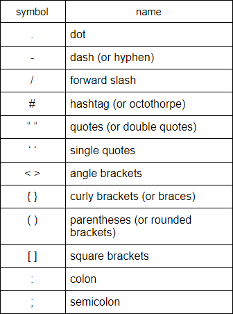

# learn-HTML-CSS-Javascript
a guide by Kenny Zhang

these three languages teaches you the basics of front-end programming
- html (hyper text markup language) tell the browser how to structure a web page
- css (cascading style sheet) describes how HTML elements are to be displayed on screen, paper, or in other media
- javascript makes web pages interactive

in other words, html is the bare bones of the human body, css is the skin that covers the bones, and javascript is the individual parts of the human body that each have their own job

## table of contents

- [resources](#resources)
  - [online code editors](#online-code-editors)
  - [cheat-sheets](#cheat-sheets)
  - [guides](#guides)
  - [other-links-and-resources](#other-links-and-resources)
- [syntax-references](#syntax-references)
- [mathematical-operators](#mathematical-operators)
- [comparison-operators](#comparison-operators)
- [basics of html](#basics-of-html) WORK IN PROGRESS

## resources

### online-code-editors
- replit: https://repl.it/
- codepen: https://codepen.io/

### cheat-sheets
- html cheat sheet: https://overapi.com/html
- css cheat sheet: https://overapi.com/css
- javascript cheat sheet: https://overapi.com/javascript

### guides
pick one OR mix and match
1. - w3schools html tutorial: https://www.w3schools.com/html/default.asp
   - w3schools css tutorial: https://www.w3schools.com/css/default.asp
   - w3schools javascript tutorial: https://www.w3schools.com/js/default.asp
2. - the odin project html and css guide: https://www.theodinproject.com/courses/html-and-css
   - the odin project javascript guide: https://www.theodinproject.com/courses/javascript
3. - htmldog html beginner tutorial: https://htmldog.com/guides/html/beginner/
   - htmldog css beginner tutorial: https://www.htmldog.com/guides/css/beginner/ 
   - htmldog javascript tutorial: https://htmldog.com/guides/javascript/
4. - mozilla getting started with html: https://developer.mozilla.org/en-US/docs/Learn/HTML/Introduction_to_HTML/Getting_started
   - mozilla getting started with css: https://developer.mozilla.org/en-US/docs/Learn/CSS/First_steps/Getting_started
   - mozilla getting started with javascript: https://developer.mozilla.org/en-US/docs/Learn/Getting_started_with_the_web/JavaScript_basics

### other-links-and-resources
- color codes: https://htmlcolorcodes.com/color-picker/
- color picker with different shades: https://www.w3schools.com/colors/colors_picker.asp
- css box model: https://css-tricks.com/the-css-box-model/
- css flex box: https://css-tricks.com/snippets/css/a-guide-to-flexbox/
- google fonts: https://fonts.google.com/

## syntax-references

also i suggest you look here: https://www.w3schools.com/js/js_syntax.asp

##  mathematical-operators
the chart below are the mathematical operators used in javascript. assume a=5 and b=2

some things to keep in mind:
- the majority of programming languages uses the same basic symbols (or operators) (+ , - , * , / )

- other operators not included above depends on the programming language you are using
  - for example: modulus (or modulo) can be either `%` or `MOD`

- in programming, you also have to follow the operator rules of PEMDAS (parentheses, exponents, multiply/ divide, add/ subtract)

- you can also combine (or concatenate) strings
  - for example:

    `"hello" + " " + "world"` ==> `"hello world"` 

## comparison-operators
assume x=5

some things to keep in mind:
- personally, i have never used 'strict not equal'

## basics-of-html 
WORK IN PROGRESS
- html uses two things: tags and attributes

- what are tags?
  - an html tag is a reserved word surrounded by angle brackets
- for example:

  `
 Hello World! 
`

- most tags must be opened `
` and closed `
` in order to function
- tip: you can wrap your content with multiple tags, just make sure you close the tags correctly
- for example:

  `<strong><em> Hello World! </em></strong>`

- the `<em>` tag has to be closed inside of the `<strong>` tag

- what are attributes?
  - attributes contain additional pieces of information inside the opening tag
- for example:

  ``

- the image source `src` is the attribute of the `` tag
- also this is one of the few tags in html that does not have a closed tag :O

## closing notes
- i know that suggesting w3schools might not be the best choice, but their guides are easy enough to understand
  - to this day, i still reference their material and some cheatsheets because i cannot memorize everything. this is normal starting out, but once you work with the languages for a long time, you will slowly memorize the content
